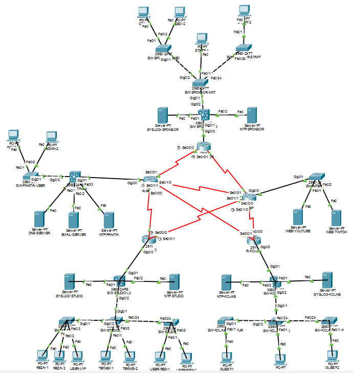
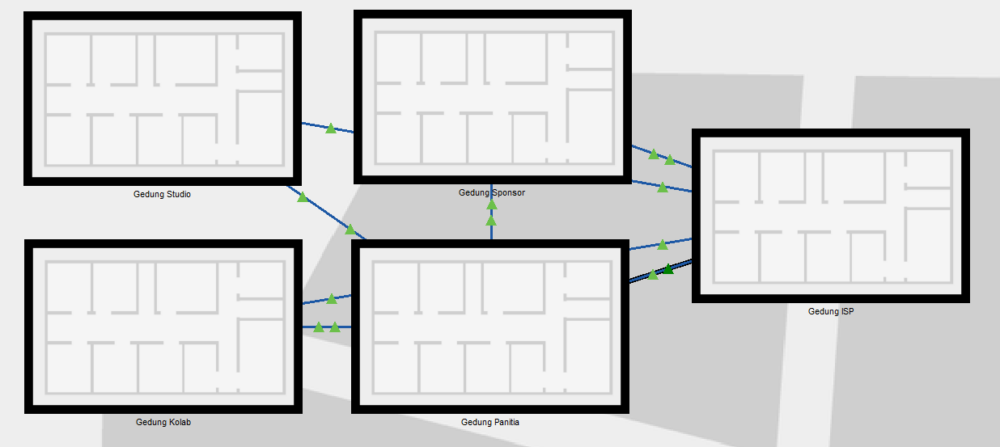
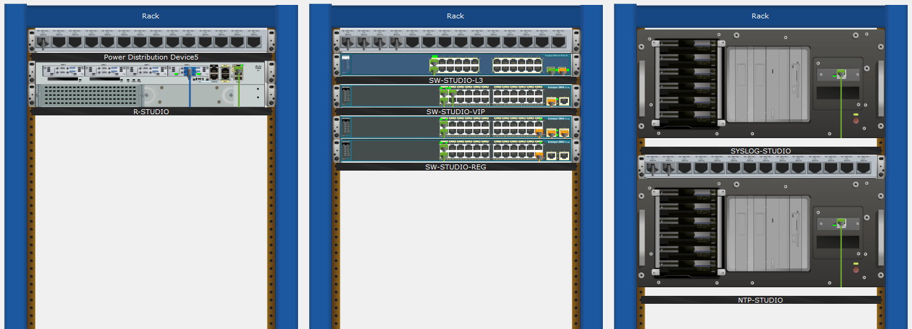

# Desain & Manajemen Jaringan Komputer - Marathon Live Streaming

## Dokumentasi Resmi Proyek Kelompok 8
**Laboratorium Jaringan Komputer (Netlab)**
*Mochtar Riady Plaza Quantum, Departemen Teknik Elektro, Lantai 3*
*Universitas Indonesia, Depok 16424*

---

## Struktur Direktori Proyek

Untuk mempermudah pengelolaan berkas, navigasi, dan kolaborasi, repositori ini telah diatur ulang menjadi struktur direktori yang bersih dan profesional sebagai berikut:

```text
marapthon-reza-arap/
├── assets/
│   └── images/
│       ├── Logical_Topology.png           # Gambar Topologi Logis Jaringan
│       ├── Physical_Topology_City.png     # Gambar Topologi Fisik (Skala Kota)
│       └── Physical_Topology_Rack.png     # Gambar Topologi Fisik (Susunan Rak/Rack)
├── docs/
│   └── Laporan_Proyek_Kelompok_8.pdf      # Laporan Resmi Proyek (PDF)
├── topology/
│   └── Topologi_Jaringan_Kelompok_8.pkt   # File Simulasi Cisco Packet Tracer (.pkt)
└── README.md                              # Dokumentasi Utama Proyek (Berkas Ini)
```

### Akses Berkas Cepat
* **Simulasi Jaringan (Packet Tracer):** [Topologi_Jaringan_Kelompok_8.pkt](topology/Topologi_Jaringan_Kelompok_8.pkt)
* **Laporan Resmi PDF:** [Laporan_Proyek_Kelompok_8.pdf](docs/Laporan_Proyek_Kelompok_8.pdf)

### Galeri Topologi

#### Topologi Logis Jaringan


#### Topologi Fisik (Skala Kota)


#### Topologi Fisik (Susunan Rak/Rack)


---

## Ringkasan Skenario & Klaster Jaringan

Jaringan ini dirancang khusus untuk mendukung infrastruktur **Marathon Live Streaming** (yang melibatkan tokoh publik Reza Arap) dengan stabilitas tinggi, pembagian hak akses yang ketat, dan efisiensi alokasi IP Address. Jaringan dibagi menjadi **4 Klaster Utama** dan **1 Entitas Luar**:

*   **Cluster Studio Utama:** Pusat aktivitas streaming (Reza Arap) dan ruang kontrol siaran. Klaster ini memiliki tingkat keamanan super ketat untuk mencegah segala bentuk kebocoran data siaran.
*   **Cluster Sponsor:** Area khusus mitra bisnis dan investor. Lalu lintas komunikasi keluar dari klaster ini diisolasi secara ketat demi keamanan korporat (hanya CEO yang memiliki akses komunikasi terbatas).
*   **Cluster Tim Kolaborator:** Area terbuka untuk Guest Streamer dan Moderator Chat guna melakukan interaksi publik secara dinamis.
*   **Panitia Event (Central Hub):** Titik sentral jaringan yang bertindak sebagai jembatan lalu lintas data antar klaster, sekaligus menyediakan layanan infrastruktur krusial seperti DNS dan Email Server.
*   **Internet Global:** Jaringan luar tempat bernaungnya platform streaming (Web YouTube & Twitch).

---

## Perhitungan Host & Segmentasi VLAN

### 1. Perhitungan Unit Dasar (Total Populasi)
Menggunakan rumus berbasis nilai kelompok ($X = 8$), total populasi penonton/staf dasar yang didukung adalah **926 Host**, dengan rincian perhitungan:

| Kategori Kelompok | Rumus Perhitungan | Rumus dengan $X = 8$ | Total Host |
| :--- | :---: | :---: | :---: |
| **Teknisi Broadcast** | $X + 24$ | $8 + 24$ | **32 Host** |
| **Kelompok 1 – 10** | $X + 250$ | $8 + 250$ | **258 Host** |
| **Kelompok 11 – 15** | $X^2 + 60$ | $8^2 + 60$ | **124 Host** |
| **Kelompok 16 – 20** | $X + 310$ | $8 + 310$ | **318 Host** |
| **Kelompok 21 – 27** | $2X + 210$ | $2(8) + 210$ | **226 Host** |
| **Total Populasi (Klp 1-27)** | - | $258 + 124 + 318 + 226$ | **926 Host** |

---

### 2. Segmentasi VLAN per Klaster

Segmentasi dihitung menggunakan porsi persentase (**10%**, **60%**, **30%**) dari total populasi dasar (926 host) ditambah dengan perangkat aktor tambahan yang terdefinisi pada skenario.

#### A. Cluster Studio Utama
*   **VIP & Penonton Khusus (10%):** $92.6 \approx 93$ User + $0$ Tambahan = **93 Host**
*   **Teknisi & Crew Studio (60%):** $555.6 \approx 555$ User + $32$ Teknisi = **587 Host**
*   **Penonton Reguler (30%):** $277.8 \approx 278$ User + $2$ Host Reza = **280 Host**

#### B. Cluster Sponsor
*   **Eksekutif & Manajer (10%):** $92.6 \approx 93$ User + $2$ CEO = **95 Host**
*   **Tim Marketing (60%):** $555.6 \approx 555$ User + $0$ Tambahan = **555 Host**
*   **Staf Umum (30%):** $277.8 \approx 278$ User + $0$ Tambahan = **278 Host**

#### C. Cluster Kolaborator
*   **Donatur & Super Moderator (10%):** $92.6 \approx 93$ User + $6$ Guest Streamer = **99 Host**
*   **Moderator & Crew Teknis (60%):** $555.6 \approx 555$ User + $0$ Tambahan = **555 Host**
*   **Penonton Aktif (30%):** $277.8 \approx 278$ User + $0$ Tambahan = **278 Host**

> [!NOTE]
> **Alasan Penggunaan Segmentasi:**
> *   **VLAN:** Digunakan untuk memisahkan domain broadcast dan meningkatkan keamanan antar departemen sesuai skenario (misalnya mengisolasi jaringan penonton reguler dari jaringan operasional teknisi dan crew).
> *   **VLSM (Variable Length Subnet Mask):** Mengingat jumlah host mencapai >500 pada VLAN tertentu, penggunaan subnet mask yang fleksibel (seperti `/22`) diterapkan agar pemakaian IP Address hemat dan tidak terjadi pemborosan ruang alamat.

---

### 3. Tabel Perancangan Subnet & IP Address (VLSM)

| Klaster | VLAN | Nama VLAN | Total Host | Network Address | Subnet Mask / Prefix | Default Gateway |
| :--- | :---: | :--- | :---: | :--- | :--- | :--- |
| **STUDIO** | 10 | VIP & Penonton Khusus | 93 | `192.168.10.0` | `255.255.255.128` (/25) | `192.168.10.1` |
| | 20 | Teknisi & Crew Studio | 587 | `192.168.20.0` | `255.255.252.0` (/22) | `192.168.20.1` |
| | 30 | Penonton Reguler | 280 | `192.168.30.0` | `255.255.254.0` (/23) | `192.168.30.1` |
| **SPONSOR** | 40 | Eksekutif & Manajer | 95 | `192.168.40.0` | `255.255.255.128` (/25) | `192.168.40.1` |
| | 50 | Tim Marketing | 555 | `192.168.50.0` | `255.255.252.0` (/22) | `192.168.50.1` |
| | 60 | Staff Umum | 278 | `192.168.60.0` | `255.255.254.0` (/23) | `192.168.60.1` |
| **KOLAB** | 70 | Donatur & Super Mod | 99 | `192.168.70.0` | `255.255.255.128` (/25) | `192.168.70.1` |
| | 80 | Moderator & Crew Teknis | 555 | `192.168.80.0` | `255.255.252.0` (/22) | `192.168.80.1` |
| | 90 | Penonton Aktif | 278 | `192.168.90.0` | `255.255.254.0` (/23) | `192.168.90.1` |
| **PANITIA** | 100 | Panitia Event | 10 | `192.168.100.0` | `255.255.255.240` (/28) | `192.168.100.1` |

---

### 4. Alokasi IP Address Infrastructure (Server Statis)

| Lokasi / Cluster | Perangkat Server | IP Address | Peran / Deskripsi |
| :--- | :--- | :--- | :--- |
| **Panitia Event** | DNS Server | `192.168.100.2` | Resolusi nama domain lokal & internet |
| | Email Server | `192.168.100.3` | Layanan pengiriman surat elektronik internal |
| **Studio Core** | SYSLOG-STUDIO | `192.168.20.10` | Penyimpanan logs aktivitas sistem cluster Studio |
| | NTP-STUDIO | `192.168.20.11` | Sinkronisasi waktu perangkat di cluster Studio |
| **Sponsor Core** | SYSLOG-SPONSOR | `192.168.50.10` | Penyimpanan logs aktivitas sistem cluster Sponsor |
| | NTP-SPONSOR | `192.168.50.11` | Sinkronisasi waktu perangkat di cluster Sponsor |
| **Kolaborator Core** | SYSLOG-KOLAB | `192.168.80.10` | Penyimpanan logs aktivitas sistem cluster Kolab |
| | NTP-KOLAB | `192.168.80.11` | Sinkronisasi waktu perangkat di cluster Kolab |
| **Internet Global** | Web YouTube | `200.200.200.2` | Server Platform Streaming Utama (Eksternal) |
| | Web Twitch | `200.200.200.3` | Server Platform Streaming Cadangan (Eksternal) |

---

### 5. Alokasi Koneksi Point-to-Point (WAN /30)

Koneksi antar-router dikonfigurasi menggunakan subnet mask `/30` (`255.255.255.252`) agar efisien dalam alokasi IP Address karena koneksi *point-to-point* hanya membutuhkan 2 IP Address valid untuk host.

| Jalur Koneksi | Network Address | IP Router 1 (Internal) | IP Router 2 (Internal/ISP) |
| :--- | :--- | :--- | :--- |
| **R-STUDIO ↔ R-PANITIA** | `172.16.1.0/30` | `172.16.1.1` (R-STUDIO) | `172.16.1.2` (R-PANITIA) |
| **R-SPONSOR ↔ R-PANITIA** | `172.16.2.0/30` | `172.16.2.1` (R-SPONSOR) | `172.16.2.2` (R-PANITIA) |
| **R-KOLAB ↔ R-PANITIA** | `172.16.3.0/30` | `172.16.3.1` (R-KOLAB) | `172.16.3.2` (R-PANITIA) |
| **R-STUDIO ↔ R-ISP** | `10.10.10.0/30` | `10.10.10.2` (R-STUDIO) | `10.10.10.1` (R-ISP) |
| **R-SPONSOR ↔ R-ISP** | `10.10.21.0/30` | `10.10.21.1` (R-SPONSOR) | `10.10.21.2` (R-ISP) |
| **R-KOLAB ↔ R-ISP** | `10.10.30.0/30` | `10.10.30.1` (R-KOLAB) | `10.10.30.2` (R-ISP) |
| **R-PANITIA ↔ R-ISP** | `10.10.40.0/30` | `10.10.40.1` (R-PANITIA) | `10.10.40.2` (R-ISP) |

---

## Implementasi & Konfigurasi Perangkat

### 1. Inter-VLAN Routing & DHCP Server (L3 Switch)
Routing antar VLAN dilakukan langsung pada **Switch Layer 3 (Multilayer Switch)** menggunakan Switch Virtual Interface (SVI) untuk menjamin kecepatan *wire-speed forwarding* paket data, jauh mengungguli metode klasik *Router-on-a-Stick*. Perangkat L3 ini juga dikonfigurasi sebagai DHCP Server lokal.

#### Contoh Konfigurasi Krusial pada `SW-STUDIO-L3`:
```cisco
! Mengaktifkan fungsi inter-vlan routing di Switch L3
SW-STUDIO-L3(config)# ip routing

! Eksklusi IP Gateway dan Server agar tidak bentrok dengan IP dinamis host
SW-STUDIO-L3(config)# ip dhcp excluded-address 192.168.20.1 192.168.20.20

! Membuat Pool DHCP untuk VLAN 20 (Teknisi & Crew Studio)
SW-STUDIO-L3(config)# ip dhcp pool VLAN20
SW-STUDIO-L3(dhcp-config)# network 192.168.20.0 255.255.252.0
SW-STUDIO-L3(dhcp-config)# default-router 192.168.20.1
SW-STUDIO-L3(dhcp-config)# dns-server 192.168.100.2
SW-STUDIO-L3(dhcp-config)# domain-name studio.local

! Mengubah Port Fisik ke Interface Layer 3 (Routed Port) ke arah R-STUDIO
SW-STUDIO-L3(config)# interface g10/1
SW-STUDIO-L3(config-if)# no switchport
SW-STUDIO-L3(config-if)# ip address 10.10.10.2 255.255.255.252
```

---

### 2. Routing Dinamis (OSPF Area 0)
Proyek ini mengadopsi protokol routing dinamis **OSPF Single Area (Area 0)** untuk seluruh komponen inti karena OSPF memiliki *convergence time* yang sangat cepat dan secara dinamis dapat memetakan jalur terbaik pada topologi multi-router.

#### Contoh Injeksi OSPF dan Distribusi Default Route dari `R-ISP`:
```cisco
R-ISP(config)# router ospf 1
R-ISP(config-router)# router-id 5.5.5.5
R-ISP(config-router)# network 10.10.10.0 0.0.0.3 area 0
R-ISP(config-router)# network 200.200.200.0 0.0.0.255 area 0
! Memaksa ISP menyebarkan default route ke seluruh router internal
R-ISP(config-router)# default-information originate
```

---

### 3. Keamanan & Enkapsulasi (NAT, GRE Tunnel, ACL)

#### A. NAT Overload (PAT)
Dikonfigurasi di `R-ISP` menggunakan Access List untuk mentranslasikan blok IP Private internal (`192.168.0.0/16`) menjadi IP Public global agar seluruh host yang diizinkan dapat terhubung ke Internet Global.

#### B. GRE Tunneling (Virtual Private Channel)
Dibuat pipa komunikasi terenkapsulasi langsung antara `R-STUDIO` dan `R-SPONSOR` melewati jaringan publik menggunakan interface virtual `Tunnel 0` dengan IP subnet `10.255.255.0/30`. Hal ini menjamin lalu lintas data penting antar dua klaster vital tersebut terisolasi dan langsung.

#### C. Extended Access Control List (ACL)
Diterapkan untuk memblokir akses ke platform luar (YouTube & Twitch) sesuai dengan kebijakan skenario:
*   **Kebijakan:** Blokir total akses internet dari **VLAN 30** (Penonton Reguler Studio) serta **seluruh VLAN Sponsor** (Eksekutif, Marketing, Staff) menuju IP Server YouTube (`200.200.200.2`) & Twitch (`200.200.200.3`).

##### Contoh Implementasi ACL pada `R-STUDIO`:
```cisco
! Membuat Extended ACL untuk memblokir penonton reguler ke internet streaming
R-STUDIO(config)# ip access-list extended BLOKIR_PENONTON
R-STUDIO(config-ext-nacl)# deny ip 192.168.30.0 0.0.1.255 200.200.200.0 0.0.0.255
R-STUDIO(config-ext-nacl)# permit ip any any

! Menerapkan ACL pada interface yang mengarah ke VLAN 30
R-STUDIO(config)# interface gigabitethernet 0/0.30
R-STUDIO(config-if)# ip access-group BLOKIR_PENONTON in
```

---

## Hasil Pengujian & Validasi (Verification)

Sistem telah diuji secara menyeluruh dan divalidasi dengan hasil sebagai berikut:

*   **Uji DHCP Server (Berhasil):** Seluruh sampel host (seperti `PC REZA-1`, `CEO-1`, `GUEST-1`, dan `MOD-1`) berhasil mendapatkan IP Address otomatis secara dinamis beserta parameter DNS, Gateway, dan domain secara tepat (*DHCP request successful*).
*   **Uji Konektivitas OSPF & Inter-VLAN (Berhasil):** Pengujian *PING* antar perangkat komputer yang berada pada VLAN berbeda maupun klaster yang berjauhan menunjukkan status **Successful**.
*   **Uji Layanan Aplikasi (Email & Web) (Berhasil):**
    *   Pengiriman surat elektronik (Email) antar staf panitia dan CEO berjalan dengan lancar menggunakan nama domain `panitia.local`.
    *   Akses halaman web menggunakan browser ke platform streaming `youtube.com` dan `twitch.com` dari klaster Kolaborator (Guest/Mod) berhasil terbuka dengan sempurna (*Welcome to Cisco Packet Tracer*).
*   **Uji GRE Tunnel (Berhasil):** Koneksi dari internal Studio melintasi interface `Tunnel 0` menuju gateway seberang di cluster Sponsor (`10.255.255.2`) merespons dengan instan dengan *Round-Trip Time* (RTT) rata-rata 4ms.
*   **Uji Efektivitas ACL (Firewall) (Berhasil):** Saat dilakukan pengujian akses internet dari perangkat `PC REZA-1`, `CEO-1`, dan `STAFF-1` menuju Web Server, paket langsung diblokir (*packet dropped*) dengan status **FAILED**. Aturan keamanan ACL bekerja dengan akurasi 100%.
*   **Uji Sinkronisasi Syslog & NTP Server (Berhasil):** Seluruh rekaman log aktivitas sistem tersimpan secara terpusat di server Syslog masing-masing cluster, dan parameter waktu (*clock*) pada router/switch telah tersinkronisasi akurat ke Stratum 2 Server NTP lokal.

---

> [!TIP]
> Dokumen ini dibuat sebagai panduan dokumentasi standar operasional topologi jaringan **Marathon Live Streaming Kelompok 8**. Semua file pendukung konfigurasi (`.pkt`), laporan resmi (`.pdf`), dan dokumentasi visual berada di dalam folder yang relevan.